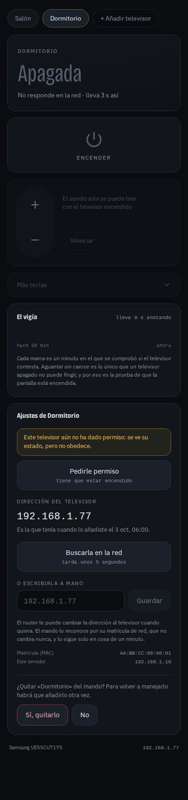

# Samsung TV Web Remote

**A self-hosted web remote control for Samsung Smart TVs (Tizen) that works over your local network — no cloud, no SmartThings account, no app to install.** Open it on your phone, and turn the TV on and off, change the volume, press remote keys and deep-link into Netflix.

Developed and tested on a **Samsung UE40NU7115** (NU7100 series, 2018). It manages **several TVs**, finds them on your network by itself, and keeps working when the router gives a TV a new IP address.

> 🇪🇸 Versión en español: [README.es.md](README.es.md). The source code, comments and UI are written in Spanish; [docs/architecture.md](docs/architecture.md) has a Spanish → English glossary of every folder and concept.

<p>
  
  
  
</p>

## What it does

- **Power on** with Wake-on-LAN plus the power key, and then **verifies the screen really stayed on** before saying so (retries once if the key was lost).
- **Power off**, **volume**, **mute**, **D-pad and common keys** (Home, Source, Back, Info, Channel ±).
- **Honest power state.** Older Samsung TVs do not report whether the screen is on and keep answering on the network for a while after being switched off. This project measures *how long* the TV has been answering instead of trusting a single reply. See [How the power state is known](#how-the-power-state-is-known).
- **Add a TV from the web UI**: it scans the LAN for Samsung TVs, you pick one, name it, and accept the pairing prompt on the TV screen.
- **Survives IP changes.** A TV is identified by its MAC address. If DHCP moves it, a one-minute watcher finds it again and updates the address on its own.
- **Netflix deep links** through DIAL: opens Netflix directly on a given title.
- **A command line** that uses exactly the same engine as the web UI, handy for cron jobs, scripts and AI agents.
- **Local only.** The TV is controlled over LAN protocols. Nothing leaves your network.

## Supported TVs

| TV | Status |
|---|---|
| **Samsung UE40NU7115** (NU7100 series, 2018, Tizen 4, wired) | Fully tested. All the timing rules were measured on this set. |
| Other 2016+ Samsung Tizen TVs with token pairing (`TokenAuthSupport: true`) | Expected to work: same protocol. Not verified on real hardware. |
| Newer models that expose `PowerState` in their REST info (≈2020+) | Supported in code and unit tests (the TV's own answer is trusted). **Not verified on real hardware.** |
| Pre-2016 Samsung TVs (no token pairing) | Not supported. The scanner lists them as incompatible. |
| LG, Sony, Android TV, Roku… | Not supported. Samsung only. |

If you try it on another model, please open an issue with the result — the JSON from `http://<tv-ip>:8001/api/v2/` is the most useful thing to include.

## Requirements

- A Linux machine that is always on, **in the same LAN/subnet as the TV** (a Raspberry Pi or a home server is plenty). It uses `ip` and `ping` from the system, no root needed.
- Python 3.10+ and Node.js 22+ (Node only to build the web UI once).
- On the TV: connected to the network, and for power-on by network, *Settings → General → Network → Expert Settings → Power On with Mobile* enabled (the exact name varies by model year).

## Quick start

```bash
git clone https://github.com/BryanQuiceno/samsung-tv-web-remote.git
cd samsung-tv-web-remote

# 1. Server
python3 -m venv .venv
.venv/bin/pip install -r servidor/requirements.txt

# 2. Web UI (built once; the server serves the result)
(cd web && npm ci && npm run build)

# 3. Run
.venv/bin/python servidor/servir.py        # http://<this-machine>:8099
```

Open `http://<this-machine>:8099` on your phone. With no TV configured yet, it goes straight to **Add a TV**:

1. Turn the TV on. The page lists the Samsung TVs it finds (about 3 seconds).
2. Tap yours and give it a name (the room is a good choice).
3. Look at the TV: a prompt appears. Choose **Allow** with the TV's own remote. This has to be done by someone in front of the TV, once per TV.

Finally, install the **watcher** in cron. It is what makes the power state reliable and what follows the TV when its IP changes:

```cron
* * * * * cd /path/to/samsung-tv-web-remote/servidor && ../.venv/bin/python vigia.py >/dev/null 2>&1
```

For a permanent setup (systemd unit, reverse proxy, a friendly local name) see [docs/deployment.md](docs/deployment.md).

## Command line

`servidor/mando.py` drives the same engine as the web UI. A small wrapper script makes it comfortable:

```bash
mando() { /path/to/.venv/bin/python /path/to/servidor/mando.py "$@"; }

mando televisores                  # configured TVs: id, name, model, IP
mando descubrir                    # Samsung TVs visible on the network right now
mando anadir 192.168.1.50 Bedroom  # add a TV, then accept the prompt on its screen

mando estado                       # apagada | encendida | dudosa (off | on | unsure)
mando on                           # power on and confirm it stayed on
mando off
mando vol 15    ;  mando vol +2    ;  mando vol
mando mute on   ;  mando mute off
mando tecla INICIO                 # press a key; `mando teclas` lists them
mando netflix https://www.netflix.com/title/80057281
mando buscar                       # find the TV again by MAC after an IP change
mando ip                           # the IP currently in use

mando --tv bedroom on              # with several TVs: pick one by id
```

Without `--tv`, commands go to the first TV that was added. Exit code is `0` on success and non-zero when the TV did not obey, so it composes well in scripts.

## How the power state is known

On the UE40NU7115 nothing on the network tells you whether the screen is on. REST, SOAP, DLNA, SSDP and the remote-control WebSocket all answer the same way on and off. Measured on the real TV:

| TV is… | What it does on the network |
|---|---|
| On | Answers always, without a single gap |
| Off | Keeps answering for ~90 s after power-off, and wakes its network card when poked, but **never stays up for more than ~2 minutes in a row** |

So the only thing an off TV cannot fake is *persistence*. A watcher (`vigia.py`, run by cron every minute) records whether the TV answers, and the state is derived from the length of the streak:

- **Off** — it does not answer.
- **On** — it has been answering for more than 3 minutes, or a power-on was just verified.
- **Unsure** — it has just appeared. The UI says so and offers to check, which takes about 2 minutes.

Models that publish `PowerState` skip all of this: their own answer is used directly.

## Documentation

| | |
|---|---|
| [docs/samsung-local-protocol.md](docs/samsung-local-protocol.md) | The LAN protocol used: ports, requests, pairing, and the UE40NU7115 quirks. Useful even if you write your own client. |
| [docs/http-api.md](docs/http-api.md) | The HTTP API the web UI uses. Call it from Home Assistant, scripts or anything else. |
| [docs/deployment.md](docs/deployment.md) | systemd service, cron watcher, reverse proxy, environment variables, data folder. |
| [docs/architecture.md](docs/architecture.md) | How the code is organised, and a Spanish → English glossary. |
| [docs/troubleshooting.md](docs/troubleshooting.md) | The TV is not found, does not turn on, does not obey… |

## Limitations

- **No authentication.** Anyone on your LAN who can reach the page can control the TVs. Do not expose it to the internet.
- **The scanner only sees TVs that are switched on**, and only on the server's own subnet (up to a /22).
- **The local protocol is not documented by Samsung.** It is the community-known protocol, stable for years, but a firmware update could change it.
- **Un-mute on power-on is applied to every TV.** The UE40NU7115 always comes back muted, so power-on removes the mute. On another model this may undo a mute you left on purpose.
- Picking a Netflix profile cannot be done over the network.
- The UI is in Spanish.

## Credits and licence

MIT — see [LICENSE](LICENSE).

- The remote-key channel uses [samsungtvws](https://github.com/xchwarze/samsung-tv-ws-api).
- Fonts bundled with the web UI: [Bricolage Grotesque](https://github.com/ateliertriay/bricolage) and [IBM Plex](https://github.com/IBM/plex), both under the SIL Open Font License.

Not affiliated with or endorsed by Samsung. "Samsung" and "Tizen" are trademarks of their owners.
